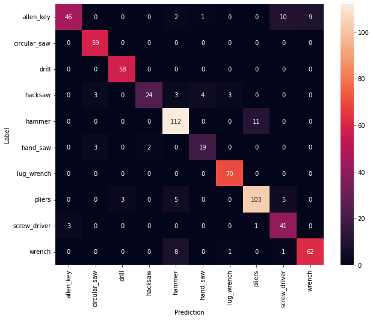

# Tool Image Classifier

  
  
   
  <em>Left: Desktop browser. Right: Iphone browser. </em>
   

### Web App Link: https://tool-image-classifier.herokuapp.com/

## Motivation
* A casual "DIYer" might not remember the names of all of their tools, making it difficult to order associated hardware and to know what each tool is for
* This app could eventually serve to help someone identify what a tool is, what the tool does, and potentially the app could generate revenue by directing the user to order replacement parts/hardware for the tool online

## Project Overview

* Built a web scraper in python that implements the Bing image search API to scrape ~4000 images of 10 different tool classes
* Implemented cleaning and preprocessing techniques such as image augmentation, image rescaling, and image reformatting using keras and pillow
* Built and evaluated two different CNN image recognition models using Tensorflow and keras, one with a custom convolutional base and head and a second that implements trasfer learning with the MobileNetV2 pretrained base (achieved an accuracy of 95%)
* Built a flask API endpoint that recieves an image from a post request, implements the model, and returns an image class and a probability 
* Wrote a web application from scratch in HTML, CSS, and JavaScript to call API and display the class prediction
* Deployed web app on Heroku: https://tool-image-classifier.herokuapp.com/

## Resources
**Python version:** 3.8

**Packages:** Tensorflow, keras, Pillow, numpy, sklearn, seaborn, requests, flask

**Languages:** python, SQLite, JavaScript, HTML, CSS

## Web Scraping and Data Analysis
* Wrote a script to implement the Bing image search API to scrape a total of ~4000 images from the web for 10 different tool classes

## Model Development
* Split the data into train and test sets (20% test) with the price as the target variable
* Tested the performance of two models; one with a pretrained base (MobileNetV2) and one with a custom base and head
  
  

  
   
  <em>Training/validation performance for CNN model with pretrained MobileNetV2 base </em>
   
  

## Model Performance

The model with the pretrained MobileNetV2 base achieved an accuracy of 95%

  

  
   
  <em>Confusion matrix for the CNN model with pretrained MobileNetV2 base applied to a batch of 32 test images </em>
   
  

## Model Productionalization

  

* Created flask API endpoint to estimate a price based on input features
* Wrote a full stack web application from scratch in HTML, CSS, and JavaScript which takes in user input, calls the flask API, and displays the predicted tool class
* Hosted the web application on Heroku: https://sb-house-price-estimator.herokuapp.com/

## Future Work

* This model was trained on a relatively small dataset (200-300 images per class). Increasing the size of the dataset would improve the accuracy
* Fine tune the model by allowing training for the top layers of the pretrained MobileNetV2 base
* Here I only used 10 tool classes, however the model would certainly be more useful if it was trained with more classes
* Improve the file upload security with server side validation of the filetype (currently I only verify the filetype using the javascrit file)
* Improve the error and exception handling in the application
* Improve the formatting and GUI for mobile and mac browsers
* Update the GUI to include information about the tool, show the associated hardware/parts for the tool, and potentially direct the user to a link to buy replacementparts/accessories
